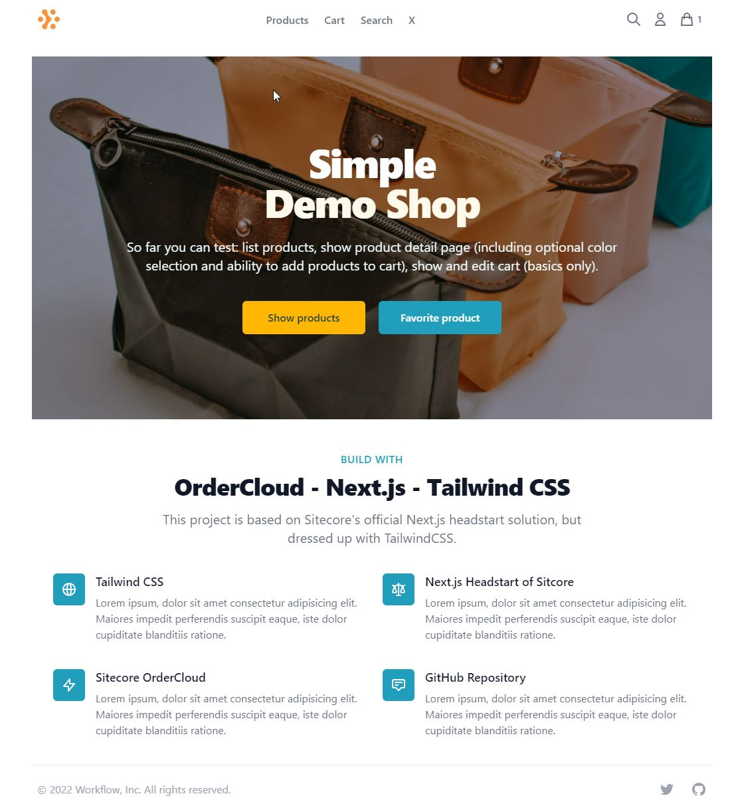

# Introduction
In general for me the [Sitecore's Next.js headstart solution](https://github.com/ordercloud-api/headstart-nextjs) fits perfectly for a quick start after the [Getting Started journey](https://ordercloud.io/learn/getting-started/welcome-to-ordercloud) of OrderCloud. In my opinion, the barrier to entry is significantly lower than that of the [official headstart solution](https://github.com/ordercloud-api/headstart). Especially since you don't have to worry about Azure infrastructure, initial seeding and middleware right from the beginning - and it's built on React ;)


# Why this fork?
This solution is based on Sitecore's Next.js headstart solution, but dressed up with [TailwindCSS](https://tailwindcss.com). So if you're interested in setup and implementation details of the solution, please check the [official readme](https://github.com/ordercloud-api/headstart-nextjs) first.

The purpose of this fork is to have more fun working with Sitecore's Next.js solution:
* It's prettier.
* A few small bugs are fixed.
* You can customize some basics (see below).

But I wouldn't consider this solution as a headstart solution (neither is the original by the way), it's more a playground for small demo projects or proof of concepts.

## Why TailwindCSS?
For me as a backend developer it is easy to use. In a few hours I've implemted some pages and modules and put a theme over it.

The principle of doing styling directly in the markup based on predefined classes of the framework is very effective and requires little familiarization with project specific CSS classes. 

It's well documented and seems to have a great community:
* Documentation: https://tailwindcss.com/docs
* Ready-made sample components: https://tailwindui.com
* Cheatsheet: https://tailwindcomponents.com/cheatsheet/

# Preview
Let's have a look at the new design:


For comparison the link to the official [Next.js demo from Sitecore](https://github.com/ordercloud-api/headstart-nextjs#demo
).

## Design changes
The following pages were already styled with TailwindCSS:
* /home
* /products
* /search (WIP)
* /product/[id]
* Basics only: 
  * /login
  * /cart
  * /checkout

## Functional modifications
The following features were implemented in addition to [those of Sitecore](https://github.com/ordercloud-api/headstart-nextjs#currently-complete-or-partially-complete-features):
* The display of (color) spec options in list views has been made possible. 
* Price calculation at the level of a product (variant) has been implemented (based on price calculation of Angualar headstart solution of Sitecore OrderCloud). 
* The currency to be displayed was made configurable.

# Getting Started
First of all, please check [this part of the official readme](https://github.com/ordercloud-api/headstart-nextjs#getting-started).

## Customize your demo shop
### Theming
* You can change the theme colors in `tailwind.config.js`.
* You can replace the logo in `/ordercloud/components/baselayout/OcHeader/index.tsx`.

### Navigation
You can edit the main navigation in `/ordercloud/components/baselayout/OcHeader/index.tsx`.

### I18N
You can edit the price format or the currency in `shopconfig.json`. 
If you are not sure which values are valid, have a look at the documentation of [Intl.NumberFormat](https://developer.mozilla.org/de/docs/Web/JavaScript/Reference/Global_Objects/Intl/NumberFormat#parameter).

## Product configuration
### Images
To make the demo shop look even better, you should maintain a few product images. For this you need to add the following properties to the product:
```
"xp": {
  "images": [
    {
      "url": "https://tailwindui.com/img/ecommerce-images/product-page-03-product-01.jpg",
      "alt": "First bag"
    },
  ]
}
```

### Color specs (optional)
I have implemented the possibility to buy products in different colors (product specs or variants). If you want to use this, you have to add the following properties to **specs**:
```
"xp": {
  "Type": "Color"
}
```
and **spec options**:
```
"xp": {
  "cssColor": "bg-red-600"
}
```

Attention: For new spec options you always have to [generate the variants](https://ordercloud.io/api-reference/product-catalogs/products/generate-variants) first!
